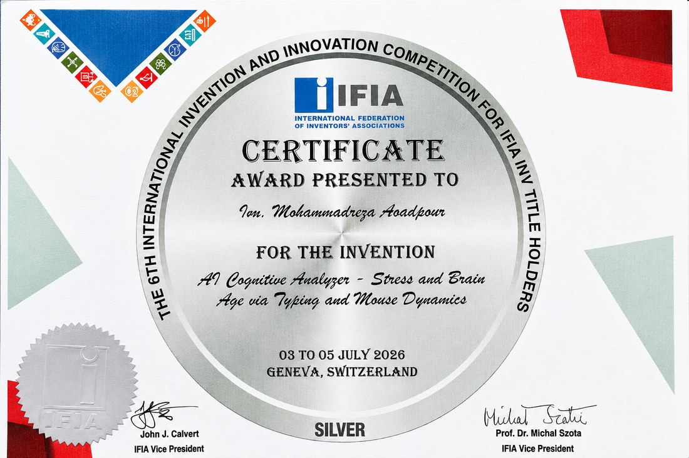

 

  

 

 

### 👋 About Me

* 🎓 **AI Engineer & Full-Stack Developer** — building intelligent, real-world digital solutions
* 🛠️ I build **AI-powered tools, computer vision systems, e-commerce platforms, and automation solutions**
* 🧠 Hands-on experience with **Machine Learning, Deep Learning, TensorFlow, PyTorch & Computer Vision**
* 💻 Full-stack experience — from **Python & ML pipelines** to **PHP, MySQL, JavaScript & modern web applications**
* 🥈 **Silver Medalist** at an international **Invention & Innovation Competition**
* 🚀 Currently exploring **LLMs, RAG pipelines, AI Agents & scalable ML systems**
* 🔥 Passionate about turning **complex ideas into practical, intelligent products**

 

 

### 🛠️ Tech Stack

**Languages**
 
 

**AI &amp; Machine Learning**
 
 

**Tools &amp; Frameworks**
 
 

 

 

<h3>🏆 ACHIEVEMENTS</h3>
 
<i>Recognized internationally for engineering &amp; innovation</i>
  

<table>
<tr>
<td align="center" width="50%">

  

 
Geneva, Switzerland · 03–05 July 2026 for <i>"AI Cognitive Analyzer – Stress and Brain Age via Typing and Mouse Dynamics"</i>
</td>
<td align="center" width="50%">

  

 
Recognized as an official IFIA "Inv" member
</td>
</tr>
</table>

 

 

 

 

 <h3>📊 GITHUB STATS</h3>  

 

  

 
      
 <h3>CONTRIBUTIONS</h3>    
   
 <h3>🔗 CONNECT WITH ME</h3>  

    

  

  

★ From <a href="https://github.com/The-Mohamadreza">The-Mohamadreza</a> — always learning, always building

   
